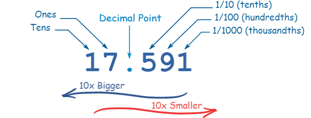
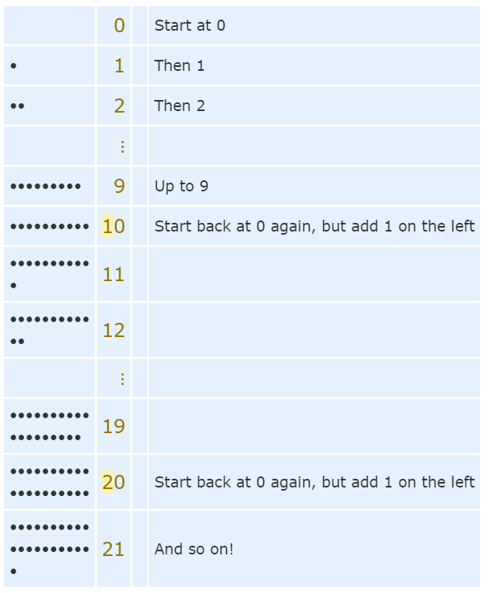

# [Java OO Tutorial](https://docs.oracle.com/javase/tutorial/java/concepts/)

## What Is an Object?
  - **Object** - a software bundle of related state, and behavior that are used to model the real-world objects.
  - **Real-world objects** - all have state and behavior.
  - **Object-oriented programming** - is treated like a real-world object, and have a state and behavior.
  - An object stores its state in fields and exposes its behavior through methods. 
  - **Methods** - operate on an object's internal state and serve as the primary mechanism for object-to-object communication.
  - **Benefits of bundling code:** 
    * Modularity - source code for an object can be written and maintained independently of the source code for other objects
    * Information-hiding 
    * Code re-use
    * Pluggability and debugging ease 

## What Is a Class?
  - Class - a blueprint or prototype from which objects are created, and are models the state and behavior of a real-world object
  - The fields represent the object's state, and the methods define its interaction with the outside world.

## [Java Classes](https://docs.oracle.com/javase/tutorial/java/javaOO/classes.html)

**Classes**
- **Sample code for a possible implementation of a class:**
  - First declare the public class, then put the three fields in the public class. 
  - Underneath the fields put the constructor for the class.
  - Underneath the constructor put the methods that you want the class to have.
- **Sample code for a possible implementation of a subclass**
  - Declare the subclass of the class first.
  - Then give the subclass a field, constructor, and a method. 

## [Binary, Decimal and Hexadecimal Numbers](https://www.mathsisfun.com/binary-decimal-hexadecimal.html)

**Binary, Decimal and Hexadecimal Numbers**
* Decimals - Every digit in a decimal number has a position, and the decimal point helps us to know which position is which.

* Bases - Base 10 or the Decimal Number System is based on the number 10.

* Counting with Different Number Systems - Count up until just before the "Base Number", then start at 0 again, but first you add 1 to the number on your left.
  - Binary Numbers - are just "Base 2", which means you can onlt start counting at 0 and then 1.
  - Hexadecimal Numbers - has 16 numbers, which look the same as the decimal numbers up to 9. After 9 there are the letters A - F in the place of decimal numbers.